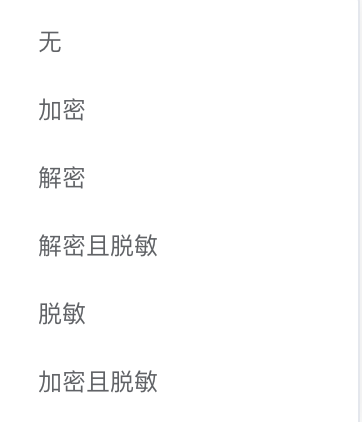
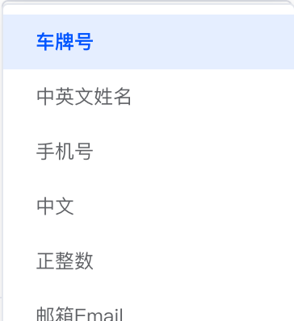
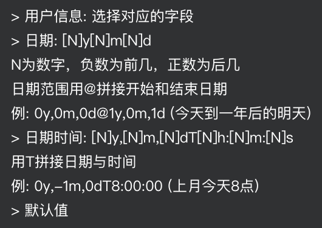
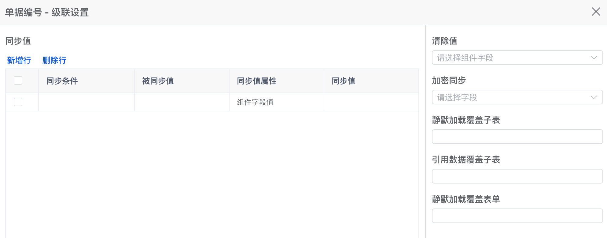
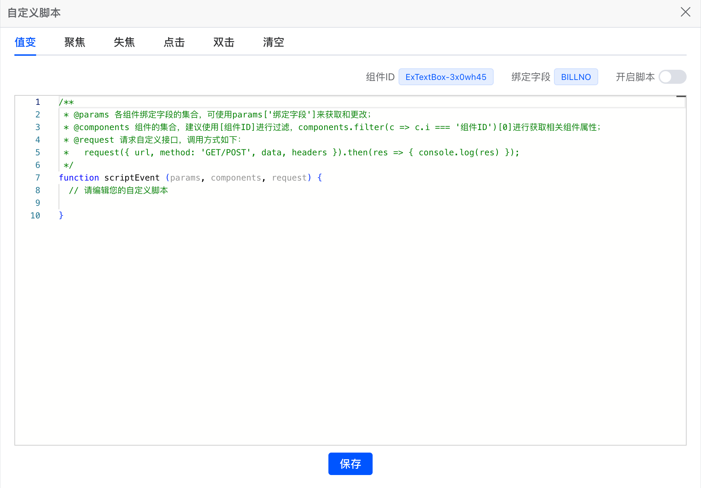

# 业务面板

## 通用属性

| <nobr>属性名称 </nobr>   | <nobr> 属性值 </nobr> | 释义                                   | 备注                                                                         |
| ------------------------ | --------------------- | -------------------------------------- | ---------------------------------------------------------------------------- |
| 绑定字段                 | `FIELD`               | 提交数据时绑定的字段值                 | 下拉单选当前页面所绑定的查询实体内所有字段                                   |
| 显示名称                 | `LABEL`               | 当前组件的 LBAEL 值                    | 切换绑定字段时会自动变更，可进行手动修改                                     |
| 必填项                   | `ISREQUIRE`           | 是否必填项                             | 是/否/表达式(Data.XXX)  例：`Data.BILLNO == 123`                         |
| 是否显示                 | `ISSHOW`              | 是否显示                               | 是/否/表达式(Data.XXX)  例：`Data.BILLNO == 123`                         |
| 加密                     | `ISAES`               | 是否加密                               |       |
| <nobr>标题提示语 </nobr> | `TOOLTIP`             | 标题后追加问号图标，鼠标移入展示提示语 |                                                                              |
| 正则校验                 | `RULESREG`            | 正则校验规则                           |       |
| 校验提示语               | `RULESREGERR`         | 校验不通过时，子组件底部出现红字提示   |                                                                              |
| 默认值                   | `DEFAULTVALUE`        | 组件默认值                             |  |
| 值计算                   | `CALC`                | 计算公式                               | (Data.XXX)  例：`Data.PRICE * Data.NUM`                                  |

## 组件属性

| <nobr>属性名称 </nobr> | <nobr> 属性值 </nobr> | 释义         | 备注                                                 |
| ---------------------- | --------------------- | ------------ | ---------------------------------------------------- |
| 控件类型               | `VTYPE`               | 当前组件类型 |                                                      |
| 禁用                   | `ISDISABLED`          | 组件禁用     | 是/否/表达式(Data.XXX)  例：`Data.BILLNO == 123` |
| 支持清除               | `CLEARABLE`           | 显示清楚按钮 | 含有输入框的部分组件支持， 1：显示 0：不显示         |
| 提示语                 | `PLACEHOLDER`         | 组件提示语   | 如 `请输入` `请选择` 等                              |
| 最大长度               | `MAXLENGTH`           | 输入长度限制 |                                                      |
| 其他属性               |                       | 组件私有属性 | 详见组件板块 [组件](../comp/ExTextBox.md)            |

## 级联设置

点击 数据级联 - 设置级联 按钮，弹出设置面板

### 相关属性

| <nobr>属性名称 </nobr>        | <nobr> 属性值 </nobr> | <nobr> 释义 </nobr>             | 备注                                                   |
| ----------------------------- | --------------------- | ------------------------------- | ------------------------------------------------------ |
| <nobr> 同步值（数组） </nobr> | `SYNC`                | <nobr> 同步值给其他组件 </nobr> | 1. 同步条件 2. 被同步值  3. 同步值属性 4. 被同步值 |
| 清除值（数组）                | `CLEAN`               | <nobr>清除其他组件的值</nobr>   | 下拉多选                                               |
| 加密同步                      | `AESENCRYSYNC`        | 加密值同步给其他组件            | 下拉单选                                               |
| 静默加载覆盖子表              | `LOADDATA`            | 静默加载覆盖子表数据            | 接口地址                                               |
| 引用数据覆盖子表              | `COPYTO`              | 引用数据覆盖子表数据            | 接口地址                                               |
| 静默加载覆盖表单              | `LOADFORM`            | 静默加载覆盖表单数据            | 接口地址                                               |

## 自定义脚本

点击 控件事件 - 脚本 - 设置脚本 按钮，弹出设置面板

::: warning 注意：
完成脚本后，需要右上角设置开启脚本渲染界面才会执行，记得保存！
:::
