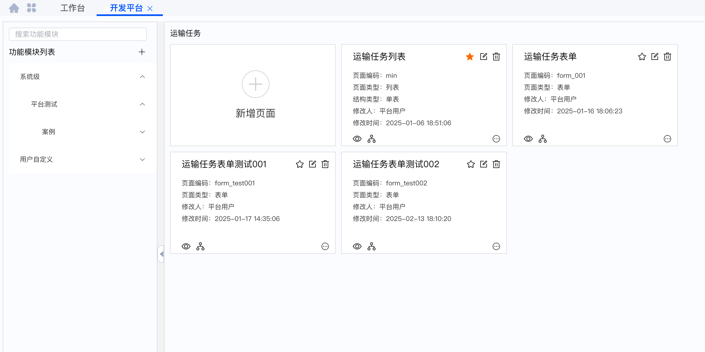
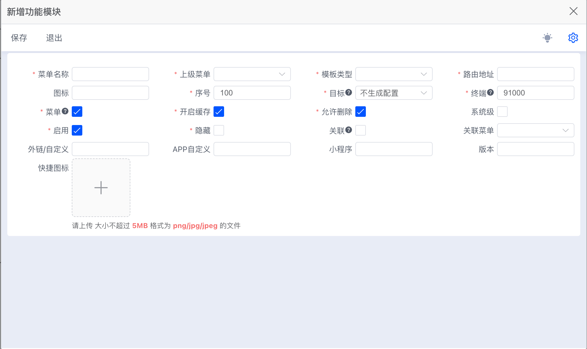
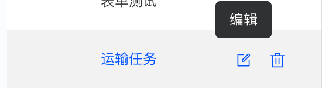
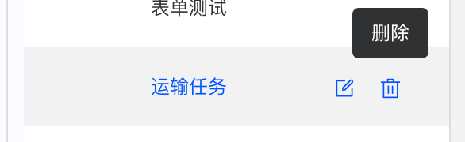
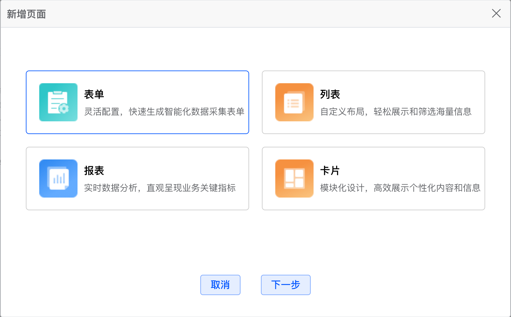
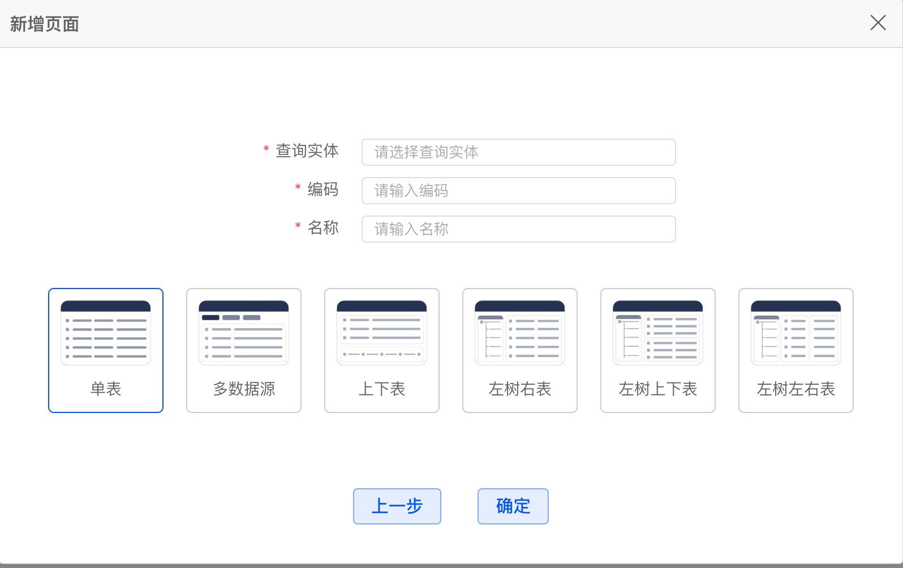

# 创建界面

## 整体界面

1. 左侧为功能模块列表。
2. 右侧为当前功能模块下的所有页面。

## 功能模块列表

1. 搜索框，输入关键字搜索功能模块。
2. 添加功能模块按钮 `+`，点击后弹出添加功能模块弹窗。
   
3. 鼠标移入功能模块名称，展示编辑按钮，点击弹出编辑弹窗，功能同新增。
   

4. 鼠标移入功能模块名称，展示删除按钮，点击删除。
   

5. 功能模块列表，点击功能模块名称，右侧展示该功能模块下的所有页面。

## 页面列表

### 新增页面

1. 点击第一个新增页面按钮，弹出新增页面弹窗。
   
2. 选择页面类型，点击下一步。
   
3. 选择查询实体，输入编码，输入页面名称，点击确定创建页面。

### 页面列表

1. 单击页面框或者编辑按钮，进入编辑页面。
2. 单击入口页面按钮 ☆，设置当前页面为入口页面。
3. 单击删除按钮，删除当前页面。
4. 单击预览按钮，进入预览页面。
